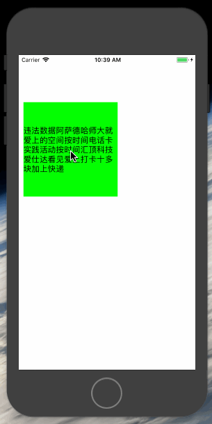

# DZMMagnifierView

***
#### 效果:



***
#### 简介:
    放大镜, 使用方便简单,支持修改偏移,放大比例

***
#### 功能代码:
```Objective-C
/// 目标视图 (注意: 传视图的Window 例子: self.view.window)
@property (nonatomic, weak) UIView *targetWindow;

/// 目标视图展示位置 (放大镜需要展示的位置)
@property (nonatomic, assign) CGPoint targetPoint;

/// 放大镜位置调整 (调整放大镜在原始位置上的偏移 Defalut: CGPointMake(0, 0))
@property (nonatomic, assign) CGPoint adjustPoint;

/// 放大比例 Defalut: 1.8
@property (nonatomic, assign) CGFloat scale;

/// 弱引用接收对象 (内部已经强引用,如果外部也强引用需要自己释放)
+ (instancetype)magnifierView;

/// 移除 (移除对象 并释放内部强引用)
- (void)remove;
```
***
#### 使用代码:
```Objective-C
- (void)longPress:(UILongPressGestureRecognizer *)longPress {

    CGPoint point = [longPress locationInView:self.label.window];
 
    if (longPress.state == UIGestureRecognizerStateBegan) {
 
        self.magnifierView = [DZMMagnifierView magnifierView];
 
        self.magnifierView.targetWindow = self.label.window;
 
        self.magnifierView.targetPoint = point;
     
    }else if (longPress.state == UIGestureRecognizerStateChanged) {
 
        self.magnifierView.targetPoint = point;
     
    }else{
 
        self.magnifierView.targetPoint = point;
 
        [self.magnifierView remove];
    }
}
```
